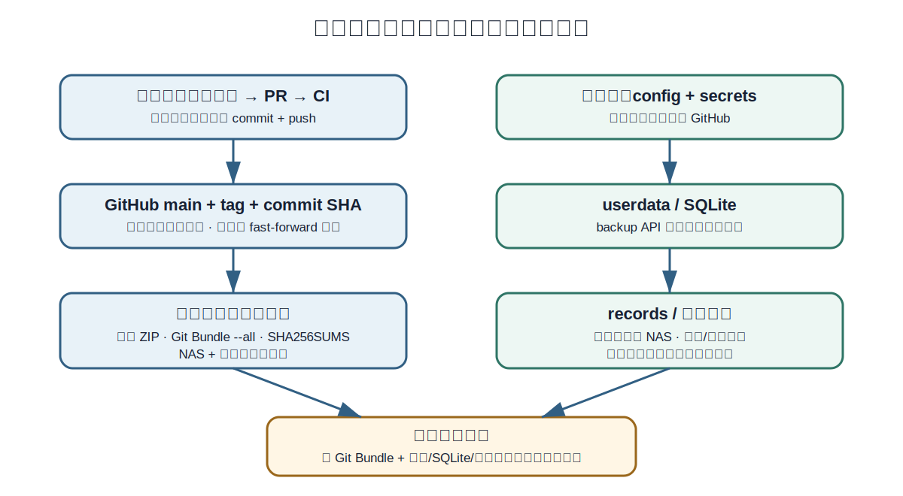

# 13. GitHub 使用、发布与防丢方案

图 2 源码历史与运行数据的双轨防丢方案

## 13.1 仓库初始化

> **1.** 在 GitHub 创建 private 仓库，默认分支 main；不要勾选自动生成与本地冲突的文件。
>
> **2.** 本地创建完整源码树和 .gitignore，再执行 git init / add / commit / remote add / push。
>
> **3.** main 分支设置保护：必须通过 CI；日常改动从 feature/\* 或 agent/\* 分支提交 PR。
>
> **4.** 生产运行目录只通过 main 或版本 tag 更新，不在生产目录直接开发。

<table>
<colgroup>
<col style="width: 100%" />
</colgroup>
<thead>
<tr class="header">
<th>git init 
git add . 
git commit -m "chore: initialize douyin recorder workspace" 
git branch -M main 
git remote add origin https://github.com/&lt;owner&gt;/&lt;repo&gt;.git 
git push -u origin main</th>
</tr>
</thead>
<tbody>
</tbody>
</table>

## 13.2 日常开发和更新

<table>
<colgroup>
<col style="width: 100%" />
</colgroup>
<thead>
<tr class="header">
<th># 开发 
git switch main 
git pull --ff-only origin main 
git switch -c feature/recipient-timeline 
# 修改、测试 
git add -A 
git commit -m "feat: persist recipient timeline" 
git push -u origin feature/recipient-timeline 
# 在 GitHub 创建 PR，CI 通过后合并 
 
# 生产/长期运行机器更新 
git switch main 
git pull --ff-only origin main 
verify.bat 
start.bat</th>
</tr>
</thead>
<tbody>
</tbody>
</table>

<table>
<colgroup>
<col style="width: 1%" />
<col style="width: 98%" />
</colgroup>
<thead>
<tr class="header">
<th></th>
<th>
<strong>为什么只允许 --ff-only</strong>

快进更新不会自动产生本地合并提交，也不会在生产目录里悄悄把两套历史揉在一起。update.bat 在拉取前检查受 Git 管理文件是否有未提交修改，有修改就停止，避免覆盖。
</th>
</tr>
</thead>
<tbody>
</tbody>
</table>

## 13.3 CI 最低检查

- Python 3.12 和 3.13 矩阵安装 dev.lock，并执行 pip check。

- tools/verify_source.py 检查必需文件、禁止文件、绝对路径和疑似 Cookie。

- python -m compileall、Ruff、pytest。

- find web -name "\*.js" \| node --check；Node 只用于 CI 语法检查，应用运行不依赖 Node。

- replay fixtures 测试目标 method、空 recipient、重复帧、乱序和重连序列。

## 13.4 版本发布资产

| **资产**                        | **作用**                        | **保存位置**              |
|---------------------------------|---------------------------------|---------------------------|
| Git tag + commit SHA            | 确定代码版本                    | GitHub + 文档             |
| 源码 ZIP                        | 无需 Git 即可审查/恢复          | GitHub Release + NAS/云盘 |
| 完整 Git Bundle --all           | 保留全部分支、tag 和提交对象    | NAS + 云盘；至少两份      |
| Windows runtime pack + manifest | 离线恢复 Python/FFmpeg/锁定依赖 | Release/NAS；不含 Cookie  |
| Docker image tag + digest       | 重建容器运行环境                | GHCR + 发布记录           |
| SHA256SUMS.txt                  | 校验所有发布资产                | 与资产同目录              |
| 验证报告                        | 记录 verify/测试/恢复演练结果   | docs/releases + 备份目录  |

<table>
<colgroup>
<col style="width: 100%" />
</colgroup>
<thead>
<tr class="header">
<th>git tag -a v0.1.0 -m "douyin recorder v0.1.0" 
git push origin v0.1.0 
 
git bundle create douyin-recorder-v0.1.0.bundle --all 
git bundle verify douyin-recorder-v0.1.0.bundle 
# 恢复验证 
git clone douyin-recorder-v0.1.0.bundle restored-repo</th>
</tr>
</thead>
<tbody>
</tbody>
</table>

## 13.5 运行数据备份

| **对象**            | **频率**            | **正确方式**                             |
|---------------------|---------------------|------------------------------------------|
| config/ 与 secrets  | 每次修改后 + 每日   | 加密备份；不得放公开仓库                 |
| userdata/SQLite     | 每日；重要迁移前    | SQLite backup API；或停机复制 db/wal/shm |
| records/ 原始媒体   | 按价值和容量        | 同步第二块盘/NAS；保留校验或抽样校验     |
| 导出/代理           | 可重建，较低优先级  | 按保留策略；必要时只备份索引             |
| Git Bundle/源码 ZIP | 每次正式发布 + 每周 | NAS 与云盘至少各一份                     |

<table>
<colgroup>
<col style="width: 1%" />
<col style="width: 98%" />
</colgroup>
<thead>
<tr class="header">
<th></th>
<th>
<strong>最重要的防丢结论</strong>

GitHub 只保护已提交并已 push 的源码；它不会保护本地未提交修改、SQLite、Cookie、配置和录像。代码备份与运行数据备份必须分开设计，并定期做恢复演练。
</th>
</tr>
</thead>
<tbody>
</tbody>
</table>

## 13.6 禁止操作

- 不要把 records/、SQLite、Cookie、.env、日志和备份 ZIP 提交到 Git。

- 不要在未确认备份前运行 git reset --hard、git clean -fdx 或覆盖数据库。

- 不要对 main 使用无条件 git push --force；极少数修复只能在确认远端 SHA 后使用 --force-with-lease。

- 不要只备份媒体不备份数据库，或只备份数据库不备份媒体索引；二者时间点必须匹配。

- 不要把 GitHub 当作唯一备份；账号、仓库、Release 资产都可能误删或失去访问。
